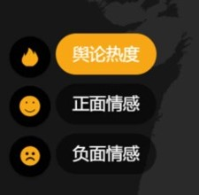
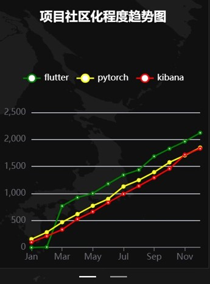
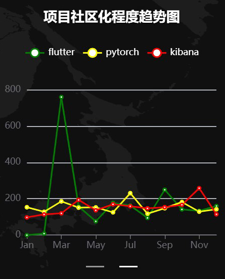
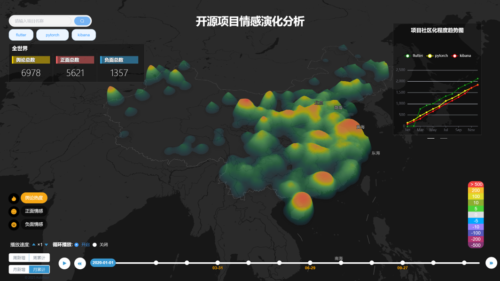

# OpenRepsSentiment

### 1 介绍

**OpenRepsSentiment** 是一个针对 **GitHub** 开源项目数据，并基于 **Gin + Gorm + Vue** 技术栈开发的开源项目情感时空可视化系统

### 2 模型设计

- 项目情感分析模型

**RoBERTa** 作为一种基于 **BERT** 模型进行改进的预训练语言表示模型，它能够提高对自然语言处理任务的性能。

- 项目社区化程度评估模型

利用非私人仓库中所有已关闭的 **IssueEvent** 和 **PullRequestEvent** 事件的 **issue_author_association** 字段和 **pull_requested_reviewer_type** 字段，找出项目志愿者数量以及该项目中由志愿者提交的 **issue** 和 **pr** 数量。

并以这三个维度数据为基础，初步设计出“开源项目社区化程度”计算公式如下：

### 3 功能模块

- 项目搜索模块

通过搜索项目关键字（或者直接选择固定仓库）获取项目的情感分析演化结果

- 情感指标筛选模块

用户可以选择自己感兴趣的情感指标，地图部分可以加载该指标对应的数据

- 时间轴模块

通过操作时间轴与情感热力图进行联动

- 项目社区化程度模块

用户搜索某个项目就可以得到该项目的社区化程度的按月累计和月增量趋势图

### 4 整体系统展示

